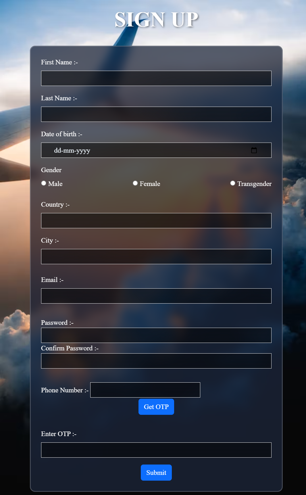
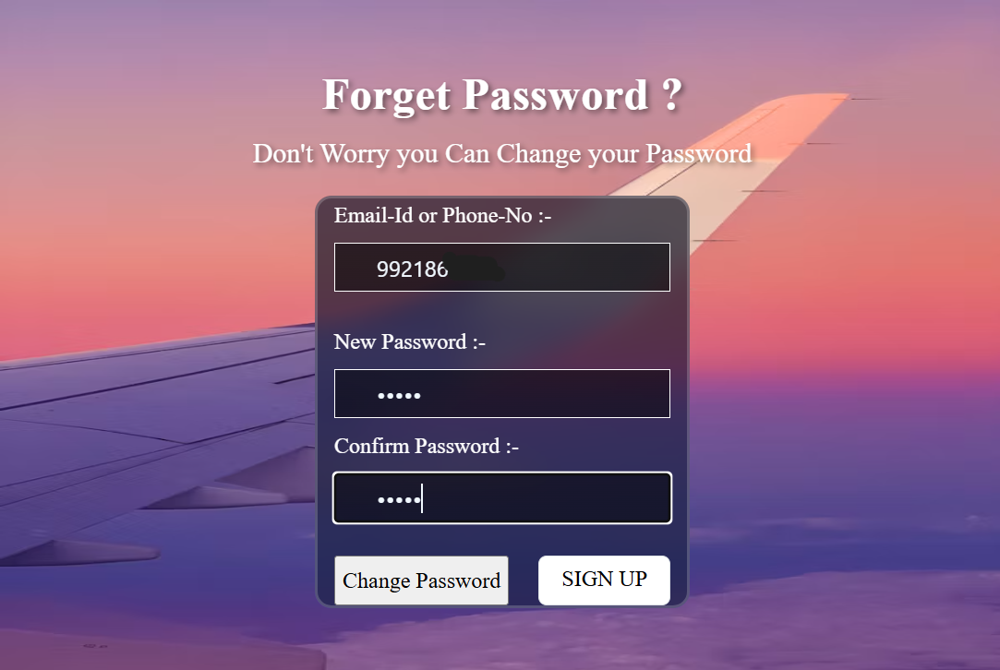
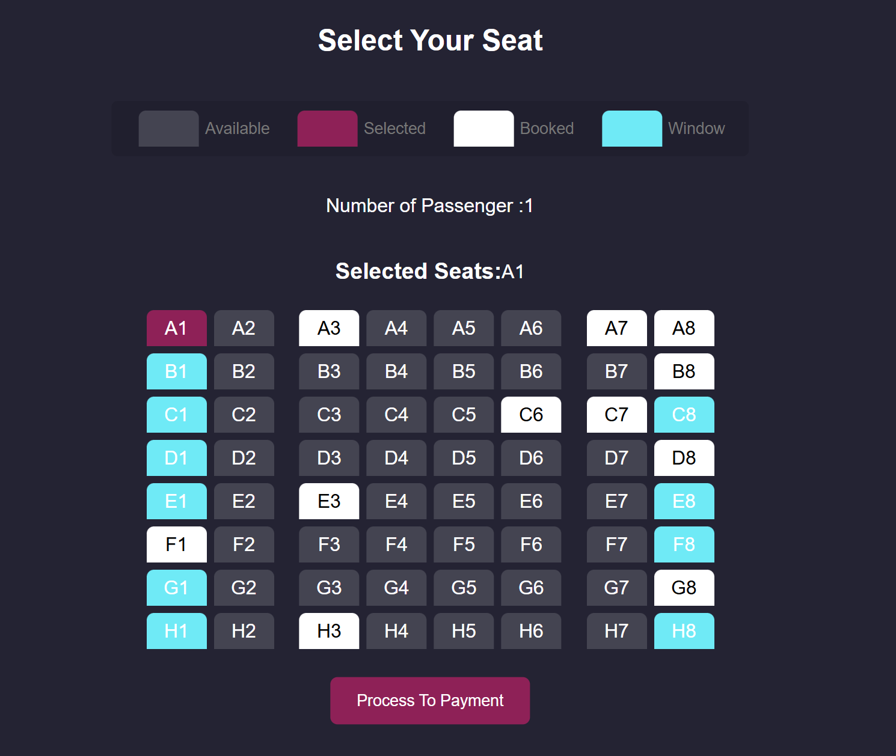
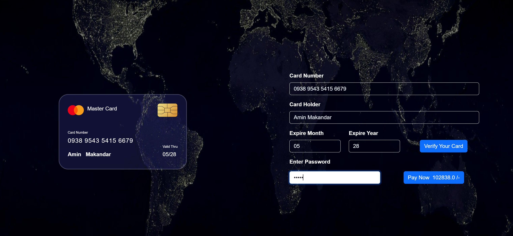
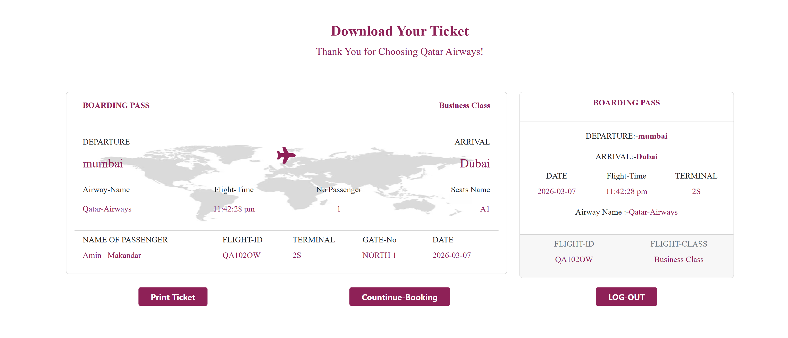

# Airline Booking System

A dynamic web application for booking airline tickets.

## Technologies Used
- Java (Core Java)
- JSP
- Servlets
- JDBC
- MySQL
- Bootstrap

## Features
- User signup and login
- OTP verification system
- One-way, return, and multi-city flight booking
- Cargo booking
- Seat selection
- Payment processing
- Flight information pages

## Tools
- Eclipse IDE
- Apache Tomcat
- MySQL Database

## Project Screenshots
### Home Page

### Signup Page

### Login Page

### Forget Password

### Flights Available

### Seat Selection

### Payment Page

### Ticket Confirmation

### Discover Globe

### India Home Page

### World Heritage

### World Home

## Author
Amin Makandar
